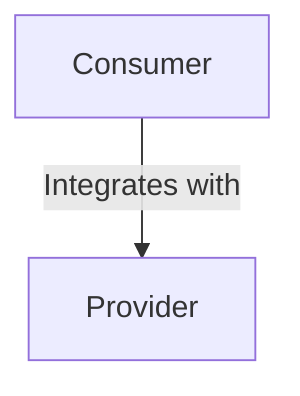

# testcontainers mockserver generated poc

Testcontainers gives a huge advantage when integrating with stable infrastructure as
postgres, kafka, and others. On the other hand, when integrating with the majority of API providers the experience
is not as good as we would like to be.

A common integration as Consumers -> Provides causes a pressure on Consumers side
to manually create mocks for all the calls that they use.

This situation happens for all the Consumers, causing:

- Mocks create a false sense of security.
- Consumers still need to validate the functionality E2E, best case scenario against a staging environment.
- A lot of code to maintain the functionality but don't add business value.

This POC focuses on reversing the responsibilities by reducing the pain on Providers to
share a [MockServer Testcontainers](https://www.testcontainers.org/modules/mockserver/) with the core behaviour
already implemented.